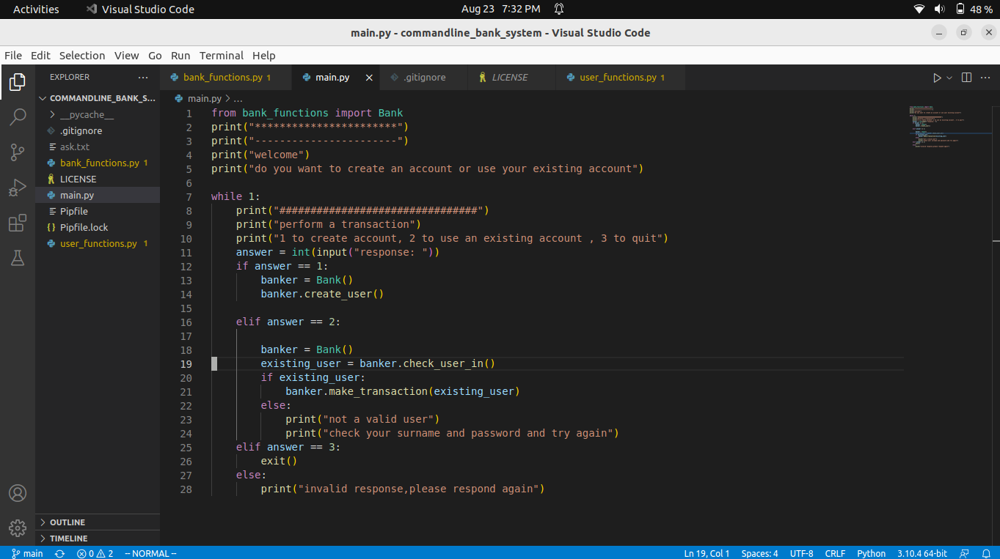
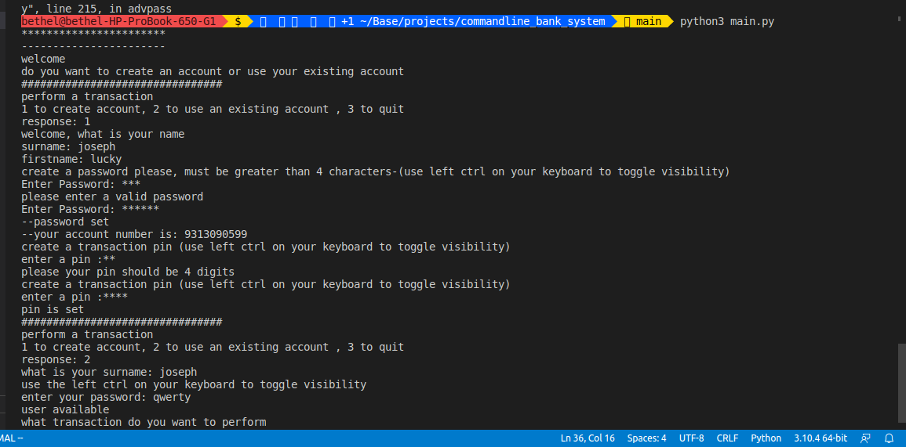

# commandline_bank_system
A bank system that works on the command line

## table of contents
* [introduction](#introduction)
* [Technologies](#technologies)
* [screenshots](#screenshots)

## introduction
this project was built to illustrate the working of a simple bank system
it is very minimal in pure python with very few libraries

## Technologies
this project was built with:
python 3.10.4

# screenshots
below are some screenshots from the project:

